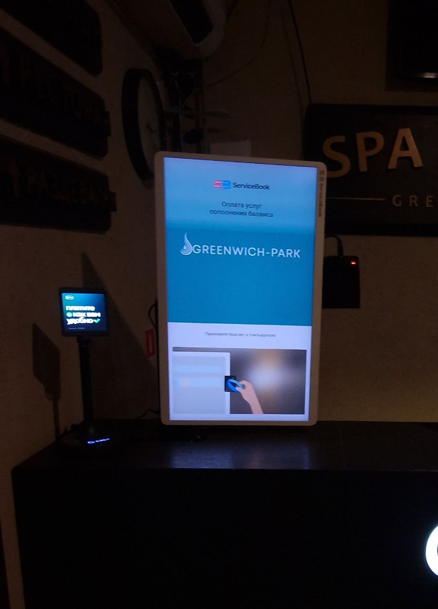

  <link rel="stylesheet" href="https://cdn.jsdelivr.net/gh/devicons/devicon@v2.12.0/devicon.min.css">

  

<h1 align="center">Hi there, I'm
  <a href="" target="_blank">
    Nikita Kovalev
  </a> 
  </h1>

 
<!-- ds -->

# Hi, I'm a mobile developer.

<!--START_SECTION:activity-->

<!--END_SECTION:activity-->

</a>

 
 
## OpenSource проекты в которых я учавствую

* [AppFlowy](https://github.com/AppFlowy-IO/appflowy-editor) - Приложение аналог Notion для заметок, на мой взгляд очень сложное и хорошо прокачивает навыки и опыт программирования на Flutter. На данный момент занимаюсь фиксом багов, в будуще хочу стать контребьютерем этого проекта (одно из условий фиксить баги чтобы показать навыки), что довольно сложно так как баги в основном сложные, которые не все могут пофисксить.

## Мои решения тестовых заданий на Flutter

* [Написание приложение с нуля Официант](https://github.com/Taverz/waiter_test) - Приложение офифиант, для проерки скорости написания кода и подхода.

## Мои пакеты

* [Уведомления](https://github.com/Taverz/multi_notification) - Пакет для интеграции с разными сервисами уведомлений.

При разработке оплаты для заведений понадобились интеграции с чеками и сервисами оплаты и POS терминалами. Была сделана интеграция и внедрена на обьекты, пакеты в доработке.

* [интеграция с ATOL Online ( https://atol.online/ ) ](https://pub.dev/packages/atol_online_dart) - Пакет для работы с чеками при оплате через терминал.
* [полный набор для работы с оплатой](https://pub.dev/packages/web_and_terminal_pay) - Пакет для полного цикла работы с операцией оплаты, от оплаты до чеков и возвратов.

## Пример использования и работы пакетов

 
 Smile:

    

